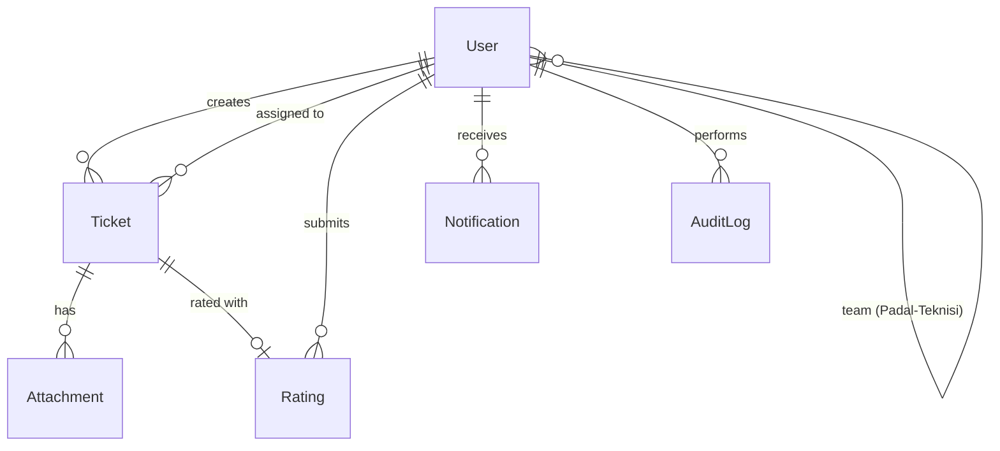
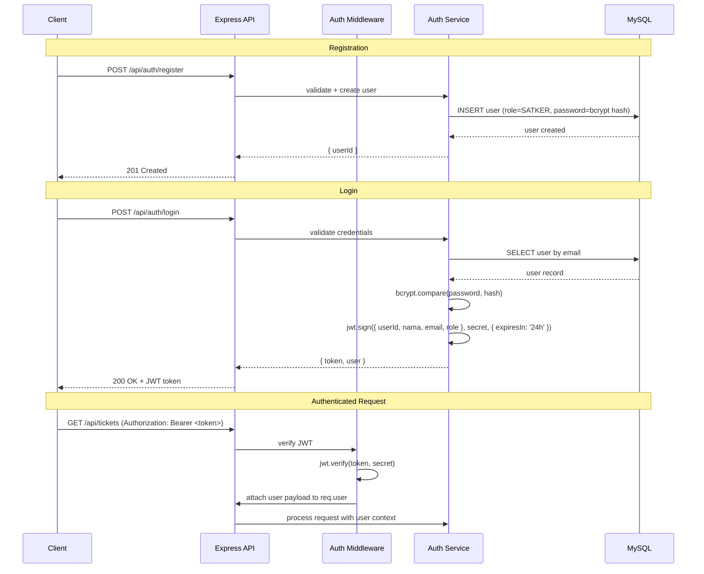
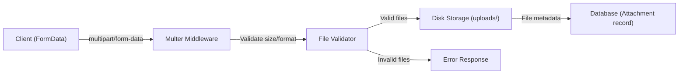

# Design Document: PoldaHelp Kalsel IT Helpdesk Ticketing System

## Overview

PoldaHelp Kalsel is an internal IT Helpdesk Ticketing system for Polda Kalimantan Selatan (South Kalimantan Police). The system enables work units (Satker) to submit IT support tickets, which are managed by system administrators (Bidtekkom), assigned to field coordinators (Padal), and visible to field technicians (Teknisi) in a read-only capacity.

The application is a full-stack monorepo built with:
- **Frontend**: Next.js 14 (App Router), React 18, Tailwind CSS, shadcn/ui, next-themes, React Hook Form + Zod, TanStack Table, Recharts, Socket.io-client
- **Backend**: Node.js, Express.js, Prisma ORM, MySQL 8, Socket.io, JWT (jsonwebtoken), Multer, bcryptjs

### Key Design Decisions

1. **Monorepo Structure**: Single repository with `frontend/` and `backend/` directories sharing common types
2. **JWT-based Auth**: Stateless authentication with 24-hour token expiry, no refresh tokens
3. **Socket.io for Real-time**: WebSocket-based notifications with room-per-user pattern
4. **Soft Delete Pattern**: Users are never physically deleted; `deletedAt` timestamp marks inactive accounts
5. **Ticket Number Sequencing**: Database-level atomic counter per year to guarantee uniqueness under concurrency
6. **File Storage**: Local disk storage via Multer with unique filenames (UUID-based)
7. **Email Service**: Nodemailer with SMTP for password reset emails
8. **Internationalization**: next-intl for language switching (Indonesian default, English future)
9. **Rating Form**: Inline within ticket detail page (not a separate modal)
10. **Teknisi Single-Team Constraint**: A Teknisi can only belong to one Padal team at a time (enforced at service layer)

## Architecture

### System Architecture Diagram

```mermaid
graph TB
    subgraph Client["Client (Browser)"]
        NextApp["Next.js App (App Router)"]
        SocketClient["Socket.io Client"]
    end

    subgraph Server["Backend (Express.js)"]
        API["REST API Layer"]
        SocketServer["Socket.io Server"]
        AuthMiddleware["Auth Middleware (JWT)"]
        RateLimit["Rate Limiter"]
        
        subgraph Services
            AuthService["Auth Service"]
            TicketService["Ticket Service"]
            RatingService["Rating Service"]
            NotificationService["Notification Service"]
            StaffService["Staff Service"]
            ReportService["Report Service"]
            AuditService["Audit Service"]
            ProfileService["Profile Service"]
            EmailService["Email Service (Nodemailer)"]
        end
        
        subgraph Middleware
            Multer["Multer (File Upload)"]
            Validator["Zod Validation"]
            RBAC["Role-Based Access Control"]
        end
    end

    subgraph Storage
        MySQL["MySQL 8 Database"]
        FileSystem["File System (uploads/)"]
    end

    NextApp -->|HTTP/REST| API
    SocketClient -->|WebSocket| SocketServer
    API --> AuthMiddleware
    AuthMiddleware --> RateLimit
    RateLimit --> Services
    API --> Multer
    API --> Validator
    API --> RBAC
    Services --> MySQL
    Multer --> FileSystem
    SocketServer --> AuthMiddleware
end
```

### Monorepo Directory Structure

```
poldahelp-kalsel/
├── frontend/
│   ├── src/
│   │   ├── app/                    # Next.js App Router pages
│   │   │   ├── (auth)/            # Auth layout group (login, register, reset)
│   │   │   ├── (dashboard)/       # Dashboard layout group (authenticated)
│   │   │   │   ├── dashboard/     # Role-specific dashboard
│   │   │   │   ├── tickets/       # Ticket list and detail views
│   │   │   │   ├── create-ticket/ # Ticket creation form
│   │   │   │   ├── staff/         # Staff management (Bidtekkom)
│   │   │   │   ├── teams/         # Team management (Bidtekkom)
│   │   │   │   ├── reports/       # Monthly reports
│   │   │   │   ├── audit-log/     # Audit log (Bidtekkom)
│   │   │   │   ├── notifications/ # Notification list
│   │   │   │   ├── settings/      # Profile, security, preferences
│   │   │   │   └── system-settings/ # System settings (Bidtekkom)
│   │   │   ├── layout.tsx         # Root layout
│   │   │   └── page.tsx           # Landing/redirect
│   │   ├── components/
│   │   │   ├── ui/                # shadcn/ui components
│   │   │   ├── layout/            # Sidebar, Header, MobileDrawer
│   │   │   ├── dashboard/         # Dashboard-specific components
│   │   │   │   ├── StatCard.tsx
│   │   │   │   ├── UnratedTicketsBanner.tsx  # Req 13.3
│   │   │   │   ├── TeknisiNoPadalState.tsx   # Req 16.4
│   │   │   │   └── TicketChart.tsx
│   │   │   ├── tickets/           # Ticket-related components
│   │   │   │   ├── InlineRatingForm.tsx      # Req 26.6 (NOT modal)
│   │   │   │   ├── RatingDisplay.tsx
│   │   │   │   ├── TicketTable.tsx
│   │   │   │   └── StatusBadge.tsx
│   │   │   ├── staff/             # Staff management components
│   │   │   │   ├── TempPasswordModal.tsx     # Req 11.3
│   │   │   │   ├── ActiveTicketWarningModal.tsx # Req 11.9
│   │   │   │   └── TeknisiTeamDropdown.tsx   # Filters padalId===null
│   │   │   ├── forms/             # Form components
│   │   │   ├── charts/            # Recharts wrappers
│   │   │   └── shared/            # Shared components (Skeleton, EmptyState, etc.)
│   │   │       ├── EmptyState.tsx
│   │   │       ├── ConfirmModal.tsx
│   │   │       ├── DivisiRequiredBanner.tsx  # Req 25.4
│   │   │       └── LoadingSkeleton.tsx
│   │   ├── hooks/                 # Custom React hooks
│   │   ├── lib/                   # Utilities, API client, socket client
│   │   ├── providers/             # Context providers (Auth, Theme, Socket, Toast)
│   │   ├── schemas/               # Zod validation schemas
│   │   ├── types/                 # TypeScript type definitions
│   │   └── i18n/                  # Internationalization (next-intl)
│   │       ├── messages/
│   │       │   ├── id.json        # Bahasa Indonesia (default)
│   │       │   └── en.json        # English (future iteration)
│   │       ├── config.ts
│   │       └── request.ts
│   ├── public/                    # Static assets
│   ├── next.config.js
│   ├── tailwind.config.ts
│   ├── tsconfig.json
│   └── package.json
├── backend/
│   ├── src/
│   │   ├── controllers/           # Route handlers
│   │   ├── services/              # Business logic
│   │   ├── middleware/            # Auth, RBAC, rate-limit, upload
│   │   ├── routes/                # Express route definitions
│   │   ├── validators/            # Zod request validation schemas
│   │   ├── socket/                # Socket.io event handlers
│   │   ├── utils/                 # Helpers (ticket number, file naming, etc.)
│   │   ├── types/                 # TypeScript types
│   │   ├── prisma/
│   │   │   ├── schema.prisma      # Database schema
│   │   │   ├── migrations/        # Migration files
│   │   │   └── seed.ts            # Seed data
│   │   └── app.ts                 # Express app setup
│   ├── uploads/                   # File upload storage directory
│   ├── tsconfig.json
│   └── package.json
├── shared/
│   ├── types/                     # Shared TypeScript interfaces
│   └── constants/                 # Shared constants (roles, statuses, categories)
├── package.json                   # Root workspace config
└── README.md
```

## Components and Interfaces

### Backend Service Layer

#### Auth Service

```typescript
interface IAuthService {
  register(data: RegisterDTO): Promise<{ userId: string }>;
  login(data: LoginDTO): Promise<{ token: string; user: UserPayload }>;
  requestPasswordReset(email: string): Promise<void>;
  resetPassword(token: string, newPassword: string): Promise<void>;
  verifyToken(token: string): UserPayload;
}

interface RegisterDTO {
  nama: string;        // 2-100 chars
  email: string;       // valid email
  nomorWhatsApp: string; // 9-15 digits
  password: string;    // 8-128 chars, 1 uppercase, 1 number
}

interface LoginDTO {
  email: string;
  password: string;
}

interface UserPayload {
  userId: string;
  nama: string;
  email: string;
  role: Role;
}
```

#### Ticket Service

```typescript
interface ITicketService {
  create(userId: string, data: CreateTicketDTO, files?: Express.Multer.File[]): Promise<Ticket>;
  assignToPadal(ticketId: string, padalId: string, assignerId: string): Promise<Ticket>;
  markComplete(ticketId: string, padalId: string): Promise<Ticket>;
  cancel(ticketId: string, actorId: string, reason?: string): Promise<Ticket>;
  getById(ticketId: string): Promise<Ticket>;
  listForSatker(userId: string, pagination: PaginationDTO): Promise<PaginatedResult<Ticket>>;
  listForBidtekkom(pagination: PaginationDTO): Promise<PaginatedResult<Ticket>>;
  listForPadal(padalId: string, pagination: PaginationDTO): Promise<PaginatedResult<Ticket>>;
  listForTeknisi(teknisiId: string, pagination: PaginationDTO): Promise<PaginatedResult<Ticket>>;
  generateTicketNumber(): Promise<string>;
}

interface CreateTicketDTO {
  judul: string;       // 1-150 chars
  deskripsi: string;   // 1-2000 chars
  kategori: TicketCategory;
  lokasi: string;      // 1-200 chars
}
```

#### Rating Service

```typescript
interface IRatingService {
  submitRating(userId: string, ticketId: string, data: RatingDTO): Promise<Rating>;
  getRatingByTicket(ticketId: string): Promise<Rating | null>;
}

interface RatingDTO {
  bintang: number;     // 1-5 integer
  feedback: string;    // 1-1000 chars, no whitespace-only
}
```

#### Notification Service

```typescript
interface INotificationService {
  create(data: CreateNotificationDTO): Promise<Notification>;
  getByUser(userId: string, pagination: PaginationDTO): Promise<PaginatedNotifications>;
  markAsRead(notificationId: string, userId: string): Promise<void>;
  markAllAsRead(userId: string): Promise<void>;
  deleteNotification(notificationId: string, userId: string): Promise<void>;
  getUnreadCount(userId: string): Promise<number>;
  emitToUser(userId: string, notification: Notification): void;
}

interface CreateNotificationDTO {
  userId: string;
  type: NotificationType;
  ticketNumber: string;
  message: string;
}
```

#### Staff Service

```typescript
interface IStaffService {
  listUsers(pagination: PaginationDTO, filters?: UserFilters): Promise<PaginatedResult<User>>;
  changeRole(targetUserId: string, newRole: Role, actorId: string): Promise<void>;
  resetPassword(targetUserId: string, actorId: string): Promise<{ temporaryPassword: string }>;
  softDelete(targetUserId: string, actorId: string, forceDelete?: boolean): Promise<void>;
  checkActiveTickets(userId: string): Promise<{ hasActiveTickets: boolean; activeTicketCount: number }>;
  addTeknisiToPadal(teknisiId: string, padalId: string, actorId: string): Promise<void>;
  removeTeknisiFromPadal(teknisiId: string, padalId: string, actorId: string): Promise<void>;
  getPadalTeams(): Promise<PadalTeam[]>;
  getAvailableTeknisi(): Promise<User[]>; // Teknisi with padalId === null
}
```

**Teknisi Single-Team Validation (Req 11.6):**

```typescript
// In StaffService.addTeknisiToPadal()
async addTeknisiToPadal(teknisiId: string, padalId: string, actorId: string): Promise<void> {
  const teknisi = await prisma.user.findUnique({ where: { id: teknisiId } });
  if (!teknisi || teknisi.role !== 'TEKNISI') {
    throw new AppError(400, 'BUSINESS_RULE_ERROR', 'User yang dipilih bukan Teknisi');
  }
  // CRITICAL: Teknisi can only belong to one team
  if (teknisi.padalId !== null) {
    throw new AppError(409, 'CONFLICT',
      'Teknisi ini sudah tergabung dalam tim Padal lain. Lepaskan dari tim saat ini sebelum menambahkan ke tim baru.'
    );
  }
  const padal = await prisma.user.findUnique({ where: { id: padalId } });
  if (!padal || padal.role !== 'PADAL' || padal.deletedAt !== null) {
    throw new AppError(400, 'BUSINESS_RULE_ERROR', 'Padal tidak ditemukan atau tidak aktif');
  }
  await prisma.user.update({ where: { id: teknisiId }, data: { padalId } });
  await auditService.log({ eventType: 'TEAM_ASSIGNMENT', actorId, ... });
}
```

**Soft-Delete with Active Ticket Warning (Req 11.9):**

```typescript
// In StaffService.softDelete()
async softDelete(targetUserId: string, actorId: string, forceDelete?: boolean): Promise<void> {
  const activeTickets = await prisma.ticket.count({
    where: { creatorId: targetUserId, status: { in: ['PENDING', 'PROSES'] } },
  });
  if (activeTickets > 0 && !forceDelete) {
    throw new AppError(400, 'HAS_ACTIVE_TICKETS', `User memiliki ${activeTickets} tiket aktif`, {
      activeTicketCount: activeTickets,
      requiresConfirmation: true,
    });
  }
  await prisma.user.update({ where: { id: targetUserId }, data: { deletedAt: new Date() } });
  await auditService.log({ eventType: 'USER_SOFT_DELETE', actorId, targetEntityId: targetUserId,
    metadata: { activeTicketsAtDeletion: activeTickets } });
}
```

#### Report Service

```typescript
interface IReportService {
  getMonthlyReport(params: ReportParams): Promise<ReportData>;
  exportPDF(params: ReportParams): Promise<Buffer>;
  exportExcel(params: ReportParams): Promise<Buffer>;
}

interface ReportParams {
  month: number;       // 1-12
  year: number;        // 4-digit year
  padalId?: string;    // Filter for Padal role
}

interface ReportData {
  tickets: ReportTicketRow[];
  summary: {
    total: number;
    pending: number;
    proses: number;
    selesai: number;
    dibatalkan: number;
    averageRating: number | null;
  };
}
```

#### Audit Service

```typescript
interface IAuditService {
  log(event: AuditEvent): Promise<void>;
  getAuditLogs(pagination: PaginationDTO, filters?: AuditFilters): Promise<PaginatedResult<AuditLog>>;
}

interface AuditEvent {
  eventType: AuditEventType;
  actorId: string;
  actorNama: string;
  targetEntityId?: string;
  metadata?: Record<string, unknown>;
}
```

#### Profile Service

```typescript
interface IProfileService {
  getProfile(userId: string): Promise<UserProfile>;
  updateProfile(userId: string, data: UpdateProfileDTO, photo?: Express.Multer.File): Promise<UserProfile>;
  changePassword(userId: string, data: ChangePasswordDTO): Promise<void>;
}

interface UpdateProfileDTO {
  nama?: string;         // 2-100 chars
  nomorWhatsApp?: string; // 10-15 digits
  divisi?: string;       // 1-100 chars (Satker only)
}

interface ChangePasswordDTO {
  currentPassword: string;
  newPassword: string;   // 8+ chars, 1 uppercase, 1 number
}
```

### API Endpoints

#### Authentication (`/api/auth`)

| Method | Endpoint | Description | Access |
|--------|----------|-------------|--------|
| POST | `/api/auth/register` | Register new user | Public |
| POST | `/api/auth/login` | Login | Public |
| POST | `/api/auth/forgot-password` | Request password reset | Public |
| POST | `/api/auth/reset-password` | Reset password with token | Public |

#### Tickets (`/api/tickets`)

| Method | Endpoint | Description | Access |
|--------|----------|-------------|--------|
| POST | `/api/tickets` | Create ticket | Satker |
| GET | `/api/tickets` | List tickets (role-filtered) | All authenticated |
| GET | `/api/tickets/:id` | Get ticket detail | Owner/Assigned/Bidtekkom/Teknisi(via Padal) |
| PATCH | `/api/tickets/:id/assign` | Assign ticket to Padal | Bidtekkom |
| PATCH | `/api/tickets/:id/complete` | Mark ticket complete | Assigned Padal |
| PATCH | `/api/tickets/:id/cancel` | Cancel ticket | Owner Satker / Bidtekkom |
| GET | `/api/tickets/:id/attachments/:fileId` | Download attachment | Authorized viewers |

#### Ratings (`/api/ratings`)

| Method | Endpoint | Description | Access |
|--------|----------|-------------|--------|
| POST | `/api/tickets/:id/rating` | Submit rating | Ticket owner (Satker) |
| GET | `/api/tickets/:id/rating` | Get ticket rating | Authorized viewers |

#### Notifications (`/api/notifications`)

| Method | Endpoint | Description | Access |
|--------|----------|-------------|--------|
| GET | `/api/notifications` | List user notifications | Authenticated |
| PATCH | `/api/notifications/:id/read` | Mark notification as read | Owner |
| PATCH | `/api/notifications/read-all` | Mark all as read | Authenticated |
| DELETE | `/api/notifications/:id` | Delete notification | Owner |

#### Staff Management (`/api/staff`)

| Method | Endpoint | Description | Access |
|--------|----------|-------------|--------|
| GET | `/api/staff/users` | List all users | Bidtekkom |
| PATCH | `/api/staff/users/:id/role` | Change user role | Bidtekkom |
| POST | `/api/staff/users/:id/reset-password` | Reset user password | Bidtekkom |
| DELETE | `/api/staff/users/:id` | Soft delete user | Bidtekkom |
| GET | `/api/staff/teams` | List Padal teams | Bidtekkom/Padal |
| POST | `/api/staff/teams/:padalId/members` | Add Teknisi to team | Bidtekkom |
| DELETE | `/api/staff/teams/:padalId/members/:teknisiId` | Remove Teknisi | Bidtekkom |

#### Reports (`/api/reports`)

| Method | Endpoint | Description | Access |
|--------|----------|-------------|--------|
| GET | `/api/reports/monthly` | Get monthly report data | Bidtekkom/Padal |
| GET | `/api/reports/monthly/pdf` | Export report as PDF | Bidtekkom/Padal |
| GET | `/api/reports/monthly/excel` | Export report as Excel | Bidtekkom/Padal |

#### Dashboard (`/api/dashboard`)

| Method | Endpoint | Description | Access |
|--------|----------|-------------|--------|
| GET | `/api/dashboard/satker` | Satker dashboard data | Satker |
| GET | `/api/dashboard/bidtekkom` | Bidtekkom dashboard data | Bidtekkom |
| GET | `/api/dashboard/padal` | Padal dashboard data | Padal |
| GET | `/api/dashboard/teknisi` | Teknisi dashboard data | Teknisi |

#### Profile (`/api/profile`)

| Method | Endpoint | Description | Access |
|--------|----------|-------------|--------|
| GET | `/api/profile` | Get current user profile | Authenticated |
| PATCH | `/api/profile` | Update profile | Authenticated |
| PATCH | `/api/profile/password` | Change password | Authenticated |
| POST | `/api/profile/photo` | Upload profile photo | Authenticated |

#### Audit Log (`/api/audit`)

| Method | Endpoint | Description | Access |
|--------|----------|-------------|--------|
| GET | `/api/audit` | List audit logs | Bidtekkom |

#### System Settings (`/api/settings`)

| Method | Endpoint | Description | Access |
|--------|----------|-------------|--------|
| GET | `/api/settings` | Get system settings | Authenticated |
| PATCH | `/api/settings` | Update system settings | Bidtekkom |
| POST | `/api/settings/logo` | Upload system logo | Bidtekkom |

### Frontend Component Architecture

#### Layout Components

```typescript
// Sidebar with role-based menu items
interface SidebarProps {
  role: Role;
  currentPath: string;
  appName: string;
  appLogo: string;
  user: { nama: string; role: Role; foto?: string };
}

// Mobile drawer (viewport < 1024px)
interface MobileDrawerProps extends SidebarProps {
  isOpen: boolean;
  onClose: () => void;
}
```

#### State Management

The frontend uses a combination of:
1. **React Context** for global state: Auth (user/token), Theme, Socket connection, Toast notifications
2. **TanStack Query (React Query)** for server state: API data fetching, caching, and synchronization
3. **React Hook Form** for form state: All form inputs with Zod validation
4. **URL state** for pagination, filters, and search params

#### Socket.io Client Integration

```typescript
// Socket provider wraps authenticated routes
interface SocketContextValue {
  socket: Socket | null;
  isConnected: boolean;
  unreadCount: number;
}

// Connection lifecycle:
// 1. User logs in → token stored
// 2. SocketProvider mounts → connects with auth token
// 3. Server validates token → joins user to room user_{userId}
// 4. Client listens for 'notification' events → updates unread count + shows toast
// 5. User logs out → socket disconnects
```

## Data Models

### Prisma Schema

```prisma
generator client {
  provider = "prisma-client-js"
}

datasource db {
  provider = "mysql"
  url      = env("DATABASE_URL")
}

enum Role {
  SATKER
  BIDTEKKOM
  PADAL
  TEKNISI
}

enum TicketStatus {
  PENDING
  PROSES
  SELESAI
  DIBATALKAN
}

enum TicketCategory {
  HARDWARE
  SOFTWARE
  JARINGAN
  EMAIL
  WEBSITE
  LAINNYA
}
// PENDING CONFIRMATION from stakeholders (Bidtekkom Polda Kalsel)
// Do NOT run initial migration until these 6 categories are approved by operational team.
// If additional categories are needed, add them to this enum before first migration.

enum AuditEventType {
  LOGIN
  REGISTRATION
  TICKET_CREATION
  TICKET_ASSIGNMENT
  TICKET_COMPLETION
  TICKET_CANCELLATION
  TICKET_RATING
  USER_SOFT_DELETE
  ROLE_CHANGE
  PASSWORD_RESET
  PASSWORD_CHANGE
  SETTINGS_CHANGE
  TEAM_ASSIGNMENT
  TEAM_REMOVAL
}

enum NotificationType {
  TICKET_CREATED
  TICKET_ASSIGNED
  TICKET_COMPLETED
  TICKET_CANCELLED
}

model User {
  id            String    @id @default(uuid())
  nama          String    @db.VarChar(100)
  email         String    @unique @db.VarChar(255)
  password      String    @db.VarChar(255)
  nomorWhatsApp String    @db.VarChar(15)
  role          Role      @default(SATKER)
  divisi        String?   @db.VarChar(100)
  foto          String?   @db.VarChar(500)
  tema          String    @default("light") @db.VarChar(10)
  bahasa        String    @default("id") @db.VarChar(5)
  deletedAt     DateTime?
  createdAt     DateTime  @default(now())
  updatedAt     DateTime  @updatedAt

  // Relations
  ticketsCreated    Ticket[]       @relation("TicketCreator")
  ticketsAssigned   Ticket[]       @relation("TicketAssignee")
  ratings           Rating[]
  notifications     Notification[]
  auditLogsAsActor  AuditLog[]     @relation("AuditActor")
  
  // Padal-Teknisi team relation
  padalId           String?
  padal             User?          @relation("PadalTeam", fields: [padalId], references: [id])
  teamMembers       User[]         @relation("PadalTeam")

  // Password reset
  passwordResetToken   String?   @db.VarChar(255)
  passwordResetExpires DateTime?

  @@index([email])
  @@index([role])
  @@index([padalId])
  @@index([deletedAt])
}

model Ticket {
  id            String       @id @default(uuid())
  nomorTiket    String       @unique @db.VarChar(20)
  judul         String       @db.VarChar(150)
  deskripsi     String       @db.Text
  kategori      TicketCategory
  lokasi        String       @db.VarChar(200)
  status        TicketStatus @default(PENDING)
  divisiSatker  String?      @db.VarChar(100)
  
  // Timestamps
  tanggalBuat   DateTime     @default(now())
  tanggalAssign DateTime?
  tanggalSelesai DateTime?
  
  // Cancellation
  alasanBatal   String?      @db.VarChar(500)
  
  // Relations
  creatorId     String
  creator       User         @relation("TicketCreator", fields: [creatorId], references: [id])
  padalId       String?
  padal         User?        @relation("TicketAssignee", fields: [padalId], references: [id])
  attachments   Attachment[]
  rating        Rating?

  @@index([creatorId])
  @@index([padalId])
  @@index([status])
  @@index([tanggalBuat])
  @@index([nomorTiket])
}

model TicketSequence {
  id    String @id @default(uuid())
  year  Int    @unique
  seq   Int    @default(0)

  @@index([year])
}

model Attachment {
  id           String   @id @default(uuid())
  ticketId     String
  ticket       Ticket   @relation(fields: [ticketId], references: [id])
  originalName String   @db.VarChar(255)
  storedName   String   @db.VarChar(255)
  mimeType     String   @db.VarChar(100)
  size         Int
  createdAt    DateTime @default(now())

  @@index([ticketId])
}

model Rating {
  id        String   @id @default(uuid())
  ticketId  String   @unique
  ticket    Ticket   @relation(fields: [ticketId], references: [id])
  userId    String
  user      User     @relation(fields: [userId], references: [id])
  bintang   Int      // 1-5
  feedback  String   @db.Text
  createdAt DateTime @default(now())

  @@index([ticketId])
  @@index([userId])
}

model Notification {
  id        String           @id @default(uuid())
  userId    String
  user      User             @relation(fields: [userId], references: [id])
  type      NotificationType
  ticketNumber String        @db.VarChar(20)
  message   String           @db.VarChar(500)
  isRead    Boolean          @default(false)
  createdAt DateTime         @default(now())

  @@index([userId, isRead])
  @@index([userId, createdAt])
}

model AuditLog {
  id             String         @id @default(uuid())
  eventType      AuditEventType
  actorId        String
  actor          User           @relation("AuditActor", fields: [actorId], references: [id])
  actorNama      String         @db.VarChar(100)
  targetEntityId String?        @db.VarChar(255)
  metadata       Json?
  createdAt      DateTime       @default(now())

  @@index([actorId])
  @@index([eventType])
  @@index([createdAt])
  @@index([targetEntityId])
}

model SystemSettings {
  id       String  @id @default(uuid())
  appName  String  @default("PoldaHelp Kalsel") @db.VarChar(100)
  appLogo  String? @db.VarChar(500)
}
```

### Key Data Relationships




## Correctness Properties

*A property is a characteristic or behavior that should hold true across all valid executions of a system—essentially, a formal statement about what the system should do. Properties serve as the bridge between human-readable specifications and machine-verifiable correctness guarantees.*

### Property 1: Password Validation

*For any* string that does not satisfy all of: length between 8 and 128 characters, contains at least one uppercase letter, and contains at least one number, the Auth_Service SHALL reject it as a password during both registration and password reset flows, returning an error indicating which specific requirement was not met.

**Validates: Requirements 1.2, 3.4**

### Property 2: Password Hashing Invariant

*For any* valid password submitted during registration or password reset, the value stored in the database SHALL be a bcrypt hash that is not equal to the plaintext password, and verifying the plaintext against the stored hash using bcryptjs.compare SHALL return true.

**Validates: Requirements 1.6**

### Property 3: JWT Token Correctness

*For any* registered active user who logs in with valid credentials, the returned JWT token SHALL decode to contain the correct userId, nama, email, and role fields matching the user's database record, and the token expiration SHALL be exactly 24 hours from issuance.

**Validates: Requirements 2.1**

### Property 4: Password Reset Round-Trip

*For any* registered user who requests a password reset and then submits the generated token with a valid new password, the old password SHALL no longer authenticate the user, the new password SHALL successfully authenticate the user, and the reset token SHALL be invalidated (subsequent use rejected).

**Validates: Requirements 3.2**

### Property 5: Ticket Number Format and Uniqueness

*For any* set of tickets created within the system, each ticket number SHALL match the format `TKT-{4-digit year}-{5-digit zero-padded sequence}`, and no two tickets SHALL ever share the same ticket number, regardless of ticket status or deletion state.

**Validates: Requirements 5.1, 5.2, 5.5**

### Property 6: Ticket Status Transition State Machine

*For any* ticket in any status and any attempted status transition, the transition SHALL succeed if and only if it matches one of the valid transitions: PENDING→PROSES (via assignment), PROSES→SELESAI (via completion), PENDING→DIBATALKAN (via cancellation), PROSES→DIBATALKAN (via cancellation). All other transitions SHALL be rejected, and the ticket SHALL remain in its original status with no fields modified.

**Validates: Requirements 7.1, 7.2, 7.3, 6.4, 8.3**

### Property 7: Ticket Creation Preconditions

*For any* Satker attempting to create a ticket, creation SHALL be rejected if the Satker has any tickets with status SELESAI that have not been rated, OR if the Satker's divisi field is null/empty. When creation succeeds, the ticket's divisiSatker field SHALL equal the Satker's current divisi value.

**Validates: Requirements 4.3, 4.8, 4.9**

### Property 8: File Upload Validation

*For any* file submitted as a ticket attachment, the system SHALL accept it if and only if its size is ≤ 5MB AND its extension is one of {jpg, jpeg, png, pdf, doc, docx, xls, xlsx}. Files failing either condition SHALL be rejected with an error indicating whether the failure was due to size or format. The total attachment count per ticket SHALL not exceed 10.

**Validates: Requirements 4.6, 4.7, 22.2, 22.3, 22.6, 22.7**

### Property 9: Rating Validation and Preconditions

*For any* rating submission attempt, it SHALL succeed if and only if: the ticket status is SELESAI, the submitting user is the ticket creator, the ticket has no existing rating, the bintang value is an integer between 1 and 5 inclusive, and the feedback is a non-whitespace-only string between 1 and 1000 characters. Violation of any condition SHALL result in rejection.

**Validates: Requirements 9.1, 9.2, 9.3, 9.4, 9.5**

### Property 10: Notification Ownership Enforcement

*For any* notification operation (mark as read, delete), the operation SHALL succeed if and only if the notification belongs to the requesting user. Operations on notifications belonging to other users SHALL be rejected with a 403 Forbidden response.

**Validates: Requirements 10.4, 10.6, 10.8**

### Property 11: Notification Ordering and Pagination

*For any* user's notification list, notifications SHALL be returned ordered by createdAt timestamp descending (most recent first), with a maximum of 50 per page, and the unread count SHALL equal the actual number of notifications with isRead=false for that user.

**Validates: Requirements 10.9**

### Property 12: Role-Based Data Scoping

*For any* authenticated API request to ticket-related endpoints: a Satker SHALL only see their own created tickets, a Padal SHALL only see tickets assigned to them, a Teknisi SHALL only see tickets assigned to their associated Padal (or empty if unassigned), and a Bidtekkom SHALL see all tickets. Any attempt to access data outside the user's scope SHALL return 403.

**Validates: Requirements 17.3, 17.4, 17.5, 17.7, 17.10**

### Property 13: Monthly Report Date Filtering

*For any* month/year combination and any set of tickets in the database, the report SHALL return exactly those tickets whose tanggalBuat falls within the specified calendar month. For a Padal, the result SHALL be further filtered to only tickets assigned to that Padal.

**Validates: Requirements 12.1, 12.2**

### Property 14: Report Summary Aggregation

*For any* set of tickets returned in a report, the summary SHALL correctly show: total count equal to the number of tickets, per-status counts that sum to the total, and average rating calculated as the arithmetic mean of bintang values from tickets that have a rating (null if no rated tickets exist), rounded to 1 decimal place.

**Validates: Requirements 12.6**

## Error Handling

### Error Response Format

All API errors follow a consistent JSON structure:

```typescript
interface ApiError {
  success: false;
  error: {
    code: string;        // Machine-readable error code (e.g., "VALIDATION_ERROR")
    message: string;     // Human-readable message (localized)
    details?: Record<string, string>; // Field-specific errors for validation
  };
}
```

### Error Categories

| HTTP Status | Code | Usage |
|-------------|------|-------|
| 400 | `VALIDATION_ERROR` | Invalid input data (with field-specific details) |
| 400 | `BUSINESS_RULE_ERROR` | Business logic violation (unrated tickets, invalid transition) |
| 400 | `HAS_ACTIVE_TICKETS` | User has active tickets, requires confirmation for soft-delete |
| 401 | `UNAUTHORIZED` | Missing/invalid/expired JWT token |
| 403 | `FORBIDDEN` | Valid token but insufficient permissions |
| 404 | `NOT_FOUND` | Resource does not exist |
| 409 | `CONFLICT` | Duplicate resource (email exists, Teknisi already in team) |
| 413 | `FILE_TOO_LARGE` | Upload exceeds size limit |
| 415 | `UNSUPPORTED_FORMAT` | File format not allowed |
| 429 | `RATE_LIMITED` | Too many requests (includes retryAfter field) |
| 500 | `INTERNAL_ERROR` | Unexpected server error (details logged, not exposed) |

### Error Handling Patterns

#### Backend Middleware Chain

```typescript
// Global error handler (last middleware)
app.use((err: AppError, req: Request, res: Response, next: NextFunction) => {
  const statusCode = err.statusCode || 500;
  const response: ApiError = {
    success: false,
    error: {
      code: err.code || 'INTERNAL_ERROR',
      message: statusCode === 500 ? 'An unexpected error occurred' : err.message,
      details: err.details,
    },
  };
  
  if (statusCode === 500) {
    logger.error('Unhandled error', { error: err, requestId: req.id });
  }
  
  res.status(statusCode).json(response);
});
```

#### Frontend Error Handling

```typescript
// API client with interceptors
const apiClient = axios.create({ baseURL: '/api' });

apiClient.interceptors.response.use(
  (response) => response,
  (error) => {
    if (error.response?.status === 401) {
      // Token expired → redirect to login
      authStore.logout();
      router.push('/login');
    }
    return Promise.reject(error);
  }
);
```

### Validation Strategy

- **Backend**: Zod schemas validate all request bodies/params before reaching service layer
- **Frontend**: React Hook Form + Zod for client-side validation (same schemas shared where possible)
- **Database**: Prisma constraints as final safety net (unique, not null, foreign keys)

### Concurrency Handling

For ticket status transitions under concurrent requests:
1. Use Prisma's `update` with a `where` clause that includes the expected current status
2. If the update affects 0 rows (status already changed), return a conflict error
3. This provides optimistic locking without explicit lock mechanisms

```typescript
// Optimistic locking pattern for status transitions
const result = await prisma.ticket.updateMany({
  where: { id: ticketId, status: expectedCurrentStatus },
  data: { status: newStatus, ...additionalFields },
});

if (result.count === 0) {
  throw new AppError(409, 'CONFLICT', 'Ticket status has already been changed');
}
```

## Testing Strategy

### Testing Framework

- **Unit Tests**: Jest (backend), Vitest (frontend)
- **Property-Based Tests**: fast-check (JavaScript PBT library)
- **Integration Tests**: Supertest (API endpoints) with test database
- **E2E Tests**: Playwright (critical user flows)

### Property-Based Testing Configuration

- Library: **fast-check** (npm package `fast-check`)
- Minimum iterations: **100 per property test**
- Each property test tagged with: `Feature: poldahelp-kalsel, Property {number}: {title}`

### Test Organization

```
backend/
├── tests/
│   ├── unit/
│   │   ├── services/          # Service logic unit tests
│   │   ├── validators/        # Validation schema tests
│   │   └── utils/             # Utility function tests
│   ├── property/
│   │   ├── password.property.test.ts      # Property 1, 2
│   │   ├── jwt.property.test.ts           # Property 3
│   │   ├── password-reset.property.test.ts # Property 4
│   │   ├── ticket-number.property.test.ts  # Property 5
│   │   ├── status-transition.property.test.ts # Property 6
│   │   ├── ticket-creation.property.test.ts   # Property 7
│   │   ├── file-upload.property.test.ts    # Property 8
│   │   ├── rating.property.test.ts         # Property 9
│   │   ├── notification.property.test.ts   # Property 10, 11
│   │   ├── rbac.property.test.ts           # Property 12
│   │   └── report.property.test.ts         # Property 13, 14
│   ├── integration/
│   │   ├── auth.integration.test.ts
│   │   ├── tickets.integration.test.ts
│   │   ├── notifications.integration.test.ts
│   │   └── staff.integration.test.ts
│   └── setup.ts               # Test database setup/teardown
frontend/
├── tests/
│   ├── components/            # Component unit tests (Vitest + Testing Library)
│   ├── hooks/                 # Custom hook tests
│   └── e2e/                   # Playwright E2E tests
```

### Unit Test Focus Areas

- Specific examples demonstrating correct behavior for each service method
- Edge cases: empty inputs, boundary values, null/undefined handling
- Error conditions: invalid state transitions, unauthorized access attempts
- Integration points: middleware chain, socket event handling

### Property Test Implementation Pattern

```typescript
import fc from 'fast-check';

describe('Feature: poldahelp-kalsel, Property 6: Ticket Status Transition State Machine', () => {
  const validTransitions = new Map([
    ['PENDING', ['PROSES', 'DIBATALKAN']],
    ['PROSES', ['SELESAI', 'DIBATALKAN']],
    ['SELESAI', []],
    ['DIBATALKAN', []],
  ]);

  const statuses = ['PENDING', 'PROSES', 'SELESAI', 'DIBATALKAN'] as const;

  it('should allow only valid transitions', () => {
    fc.assert(
      fc.property(
        fc.constantFrom(...statuses),  // current status
        fc.constantFrom(...statuses),  // target status
        (currentStatus, targetStatus) => {
          const allowed = validTransitions.get(currentStatus) || [];
          const shouldSucceed = allowed.includes(targetStatus);
          const result = ticketService.validateTransition(currentStatus, targetStatus);
          return result.valid === shouldSucceed;
        }
      ),
      { numRuns: 100 }
    );
  });
});
```

### Integration Test Strategy

- Test full request/response cycle through Express middleware
- Use isolated test database (MySQL in Docker for CI)
- Seed data per test suite, clean up after each test
- Test Socket.io events with socket.io-client in test mode

### Coverage Targets

- Unit tests: ≥80% line coverage on service layer
- Property tests: All 14 correctness properties covered
- Integration tests: All API endpoints with happy path + primary error cases
- E2E tests: Critical flows (register → login → create ticket → assign → complete → rate)

## Authentication and Authorization Flow

### Authentication Flow



### Authorization Middleware Stack

```typescript
// Middleware order for protected routes:
// 1. authenticate → verifies JWT, attaches req.user
// 2. authorize(roles) → checks req.user.role against allowed roles
// 3. checkOwnership (optional) → verifies data belongs to requesting user

const authenticate = (req, res, next) => {
  const token = req.headers.authorization?.replace('Bearer ', '');
  if (!token) throw new AppError(401, 'UNAUTHORIZED', 'Token required');
  
  const payload = jwt.verify(token, process.env.JWT_SECRET);
  // Check if user is soft-deleted
  const user = await prisma.user.findUnique({ where: { id: payload.userId } });
  if (!user || user.deletedAt) throw new AppError(401, 'UNAUTHORIZED', 'Account inactive');
  
  req.user = payload;
  next();
};

const authorize = (...roles: Role[]) => (req, res, next) => {
  if (!roles.includes(req.user.role)) {
    throw new AppError(403, 'FORBIDDEN', 'Insufficient permissions');
  }
  next();
};
```

### Role Permission Matrix

| Resource/Action | Satker | Bidtekkom | Padal | Teknisi |
|----------------|--------|-----------|-------|---------|
| Create ticket | ✅ Own | ❌ | ❌ | ❌ |
| View tickets | Own only | All | Assigned only | Padal's only (read) |
| Assign ticket | ❌ | ✅ | ❌ | ❌ |
| Complete ticket | ❌ | ❌ | ✅ Assigned | ❌ |
| Cancel ticket | ✅ Own | ✅ Any | ❌ | ❌ |
| Rate ticket | ✅ Own | ❌ | ❌ | ❌ |
| Staff management | ❌ | ✅ | ❌ | ❌ |
| Team management | ❌ | ✅ | View own | ❌ |
| Reports | ❌ | ✅ All | ✅ Own | ❌ |
| Audit log | ❌ | ✅ | ❌ | ❌ |
| System settings | ❌ | ✅ | ❌ | ❌ |
| Profile | ✅ | ✅ | ✅ | ✅ |
| Notifications | ✅ Own | ✅ Own | ✅ Own | ✅ Own |

## Real-Time Notification Architecture

### Socket.io Server Setup

```typescript
// Socket.io server initialization with JWT auth
const io = new Server(httpServer, {
  cors: { origin: process.env.FRONTEND_URL, credentials: true },
});

// Authentication middleware for socket connections
io.use((socket, next) => {
  const token = socket.handshake.auth.token;
  try {
    const payload = jwt.verify(token, process.env.JWT_SECRET);
    socket.data.user = payload;
    next();
  } catch (err) {
    next(new Error('Authentication failed'));
  }
});

// Connection handler
io.on('connection', (socket) => {
  const userId = socket.data.user.userId;
  socket.join(`user_${userId}`);
  
  socket.on('disconnect', () => {
    socket.leave(`user_${userId}`);
  });
});
```

### Notification Event Flow

```mermaid
sequenceDiagram
    participant Actor
    participant Service as Backend Service
    participant NotifService as Notification Service
    participant DB as MySQL
    participant Socket as Socket.io Server
    participant Target as Target User Client

    Actor->>Service: Perform action (e.g., create ticket)
    Service->>Service: Process business logic
    Service->>NotifService: create notification
    NotifService->>DB: INSERT notification record
    DB-->>NotifService: notification saved
    NotifService->>Socket: io.to(`user_${targetId}`).emit('notification', payload)
    Socket-->>Target: Real-time notification event
    Target->>Target: Show toast + increment unread badge
```

### Notification Events Mapping

| Trigger Event | Target Users | Notification Type |
|--------------|-------------|-------------------|
| Ticket created | All Bidtekkom | TICKET_CREATED |
| Ticket assigned | Assigned Padal | TICKET_ASSIGNED |
| Ticket completed | Creator Satker | TICKET_COMPLETED |
| Ticket cancelled | Creator Satker + Assigned Padal (if exists) | TICKET_CANCELLED |

### Client-Side Socket Integration

```typescript
// SocketProvider component wrapping authenticated routes
function SocketProvider({ children, token }: { children: ReactNode; token: string }) {
  const [socket, setSocket] = useState<Socket | null>(null);
  const [unreadCount, setUnreadCount] = useState(0);

  useEffect(() => {
    const newSocket = io(process.env.NEXT_PUBLIC_SOCKET_URL, {
      auth: { token },
      transports: ['websocket', 'polling'],
    });

    newSocket.on('notification', (notification) => {
      setUnreadCount((prev) => prev + 1);
      toast.info(notification.message); // Show toast
    });

    newSocket.on('connect_error', (err) => {
      if (err.message === 'Authentication failed') {
        // Token expired, redirect to login
        authStore.logout();
      }
    });

    setSocket(newSocket);
    return () => { newSocket.disconnect(); };
  }, [token]);

  return (
    <SocketContext.Provider value={{ socket, unreadCount, setUnreadCount }}>
      {children}
    </SocketContext.Provider>
  );
}
```

## File Upload Handling

### Upload Architecture



### Multer Configuration

```typescript
const storage = multer.diskStorage({
  destination: (req, file, cb) => {
    const uploadDir = path.join(__dirname, '../../uploads');
    cb(null, uploadDir);
  },
  filename: (req, file, cb) => {
    const uniqueName = `${uuidv4()}${path.extname(file.originalname)}`;
    cb(null, uniqueName);
  },
});

const fileFilter = (req, file, cb) => {
  const allowedExtensions = ['.jpg', '.jpeg', '.png', '.pdf', '.doc', '.docx', '.xls', '.xlsx'];
  const ext = path.extname(file.originalname).toLowerCase();
  if (allowedExtensions.includes(ext)) {
    cb(null, true);
  } else {
    cb(new AppError(415, 'UNSUPPORTED_FORMAT', `File format ${ext} is not allowed`));
  }
};

const upload = multer({
  storage,
  fileFilter,
  limits: { fileSize: 5 * 1024 * 1024 }, // 5MB
});
```

### File Serving

- Attachments served via authenticated endpoint: `GET /api/tickets/:id/attachments/:fileId`
- Profile photos served via: `GET /api/profile/photo/:userId`
- System logo served via: `GET /api/settings/logo`
- All file access requires authentication; ticket attachments require ticket access permission

### Upload Constraints Summary

| Context | Max Size | Allowed Formats | Max Count |
|---------|----------|-----------------|-----------|
| Ticket attachment | 5MB per file | jpg, jpeg, png, pdf, doc, docx, xls, xlsx | 10 per ticket |
| Profile photo | 5MB | jpg, jpeg, png | 1 (replaces existing) |
| System logo | 5MB | jpg, jpeg, png, svg | 1 (replaces existing) |

## Email Service (Password Reset)

### Configuration

```bash
# Additional backend dependency
npm install nodemailer
npm install -D @types/nodemailer
```

**Environment variables (`.env`):**
```env
SMTP_HOST=smtp.example.com
SMTP_PORT=587
SMTP_USER=your-email@example.com
SMTP_PASS=your-password
SMTP_FROM="PoldaHelp Kalsel <noreply@poldakalsel.go.id>"
```

### Email Service Interface

```typescript
interface IEmailService {
  sendPasswordResetEmail(to: string, resetToken: string): Promise<void>;
}
```

### Implementation

```typescript
import nodemailer from 'nodemailer';
import crypto from 'crypto';

// Token generation
const rawToken = crypto.randomBytes(32).toString('hex');
const hashedToken = crypto.createHash('sha256').update(rawToken).digest('hex');

// Store hashed token + expiry in database
await prisma.user.update({
  where: { id: user.id },
  data: {
    passwordResetToken: hashedToken,
    passwordResetExpires: new Date(Date.now() + 15 * 60 * 1000), // 15 minutes
  },
});

// Send email with raw token in link
const resetUrl = `${process.env.FRONTEND_URL}/reset-password?token=${rawToken}`;
await transporter.sendMail({
  from: process.env.SMTP_FROM,
  to: user.email,
  subject: 'Reset Password - PoldaHelp Kalsel',
  html: `<p>Klik link berikut untuk reset password Anda:</p><a href="${resetUrl}">${resetUrl}</a><p>Link berlaku 15 menit.</p>`,
});

// IMPORTANT (Req 3.5): If email not registered, still return success response
// to prevent email enumeration attacks
```

## Sidebar Navigation Menu Order

The sidebar menu items MUST follow this exact order per role (Req 28.1–28.4):

### Satker Menu
| # | Label | Route | Icon |
|---|-------|-------|------|
| 1 | Dashboard | `/dashboard` | LayoutDashboard |
| 2 | Tiket Saya | `/dashboard/tickets` | Ticket |
| 3 | Buat Tiket | `/dashboard/create-ticket` | PlusCircle |
| 4 | Notifikasi | `/dashboard/notifications` | Bell (+ badge) |
| 5 | Pengaturan | `/dashboard/settings` | Settings |

### Bidtekkom Menu
| # | Label | Route | Icon |
|---|-------|-------|------|
| 1 | Dashboard | `/dashboard` | LayoutDashboard |
| 2 | Semua Tiket | `/dashboard/tickets` | Ticket |
| 3 | Manajemen User | `/dashboard/staff` | Users |
| 4 | Manajemen Tim | `/dashboard/teams` | UserCog |
| 5 | Laporan | `/dashboard/reports` | FileText |
| 6 | Audit Log | `/dashboard/audit-log` | Shield |
| 7 | Notifikasi | `/dashboard/notifications` | Bell (+ badge) |
| 8 | Pengaturan Sistem | `/dashboard/system-settings` | Cog |
| 9 | Pengaturan | `/dashboard/settings` | Settings |

### Padal Menu
| # | Label | Route | Icon |
|---|-------|-------|------|
| 1 | Dashboard | `/dashboard` | LayoutDashboard |
| 2 | Tiket Saya | `/dashboard/tickets` | Ticket |
| 3 | Laporan | `/dashboard/reports` | FileText |
| 4 | Tim Saya | `/dashboard/my-team` | Users |
| 5 | Notifikasi | `/dashboard/notifications` | Bell (+ badge) |
| 6 | Pengaturan | `/dashboard/settings` | Settings |

### Teknisi Menu
| # | Label | Route | Icon |
|---|-------|-------|------|
| 1 | Dashboard | `/dashboard` | LayoutDashboard |
| 2 | Tiket | `/dashboard/tickets` | Ticket |
| 3 | Notifikasi | `/dashboard/notifications` | Bell (+ badge) |
| 4 | Pengaturan | `/dashboard/settings` | Settings |

## Frontend UX Flows

### Divisi Check Before Ticket Creation (Req 4.9, 25.2, 25.4)

```typescript
// In create-ticket/page.tsx
function CreateTicketPage() {
  const { user } = useAuth();

  // If divisi is not set, show redirect banner instead of form
  if (!user.divisi) {
    return (
      <DivisiRequiredBanner
        message="Anda belum mengisi divisi. Lengkapi profil Anda terlebih dahulu."
        redirectTo="/dashboard/settings"
      />
    );
  }

  return <TicketCreationForm />;
}
```

### Divisi Persistent Highlight in Settings (Req 25.2)

In addition to blocking ticket creation, the profile settings page itself must show a persistent visual indicator when divisi is empty:

```typescript
// In settings/page.tsx (Profile tab)
function ProfileSettingsTab() {
  const { user } = useAuth();
  const divisiEmpty = user.role === 'SATKER' && !user.divisi;

  return (
    <div>
      {divisiEmpty && (
        <Alert variant="warning" className="mb-4">
          <AlertTitle>Divisi belum diisi</AlertTitle>
          <AlertDescription>
            Isi field divisi di bawah agar Anda dapat membuat tiket baru.
          </AlertDescription>
        </Alert>
      )}
      
      {/* Profile form fields */}
      <FormField name="divisi" highlight={divisiEmpty} /> {/* Visual ring/border highlight */}
    </div>
  );
}
// This alert persists on every visit until divisi is set (Req 25.2)
```

### Unrated Tickets Alert Banner (Req 13.3)

**Component:** `components/dashboard/UnratedTicketsBanner.tsx`

```typescript
interface UnratedTicketsBannerProps {
  unratedCount: number;
}

// Displayed on Satker dashboard ABOVE the recent tickets table
// Only renders when unratedCount > 0
// Uses amber/warning color scheme
// Contains "Lihat Tiket" button → navigates to /dashboard/tickets?status=SELESAI&unrated=true
```

### Inline Rating Form in Ticket Detail (Req 26.6)

**NOT a modal.** The rating form is rendered inline within the ticket detail page.

```typescript
// In tickets/[id]/page.tsx
function TicketDetailPage({ ticket }) {
  const { user } = useAuth();
  const showRatingForm = 
    ticket.status === 'SELESAI' && 
    user.role === 'SATKER' && 
    ticket.creatorId === user.userId && 
    !ticket.rating;

  return (
    <div>
      <TicketInfo ticket={ticket} />
      <TicketAttachments attachments={ticket.attachments} />
      <TicketTimeline ticket={ticket} />
      
      {showRatingForm && <InlineRatingForm ticketId={ticket.id} />}
      {ticket.rating && <RatingDisplay rating={ticket.rating} />}
    </div>
  );
}
```

### Teknisi Without Padal — Empty State (Req 16.4, 17.6)

**Component:** `components/dashboard/TeknisiNoPadalState.tsx`

```typescript
// Dashboard API response includes: { hasPadal: boolean, ... }
// When hasPadal === false:
// - Hide stat cards
// - Hide ticket table
// - Show ONLY the unassigned message

function TeknisiDashboard({ data }) {
  if (!data.hasPadal) {
    return (
      <EmptyState
        icon={Lock}
        title="Belum Ditugaskan ke Tim"
        description="Anda belum ditugaskan ke tim Padal manapun. Hubungi Bidtekkom untuk mendapatkan penugasan tim."
      />
    );
  }
  return <TeknisiDashboardContent data={data} />;
}
```

**API behavior for Teknisi without Padal (Req 17.6):**
- `GET /api/tickets` → returns `{ data: [], total: 0 }`
- `GET /api/tickets/:id` → returns 403 Forbidden
- `GET /api/dashboard/teknisi` → returns `{ hasPadal: false, activeCount: 0, completedCount: 0 }`

### Soft-Delete Warning Modal (Req 11.9)

**Flow:**
1. Bidtekkom clicks "Hapus" on a user → `DELETE /api/staff/users/:id`
2. If user has active tickets, API returns `{ code: "HAS_ACTIVE_TICKETS", details: { activeTicketCount: 3 } }`
3. Frontend shows warning modal with active ticket count
4. If confirmed → re-send `DELETE /api/staff/users/:id?forceDelete=true`
5. If cancelled → close modal, no action

### Temporary Password Display Modal (Req 11.3)

**Flow:**
1. Bidtekkom clicks "Reset Password" → confirmation modal
2. After confirm → `POST /api/staff/users/:id/reset-password`
3. API returns `{ temporaryPassword: "Abc123XyzQwe" }`
4. Frontend shows one-time display modal:
   - Shows the temporary password in a copyable field
   - "Salin" button copies to clipboard
   - Warning: "Password ini hanya ditampilkan sekali"
   - After modal closes, password is gone (not stored in state)

**CRITICAL implementation note for `TempPasswordModal.tsx`:**
```typescript
// Use LOCAL state only — never store in global state, context, or zustand
function TempPasswordModal({ isOpen, onClose, tempPassword }: Props) {
  const [localPassword, setLocalPassword] = useState<string | null>(tempPassword);

  const handleClose = () => {
    setLocalPassword(null); // Clear from memory before closing
    onClose();
  };

  // ...render modal with localPassword
}
// After modal unmounts, the password is garbage-collected
```

## Internationalization (i18n)

### Library: next-intl

```bash
npm install next-intl
```

### Structure

```
frontend/src/i18n/
├── messages/
│   ├── id.json    ← Bahasa Indonesia (default, implemented first)
│   └── en.json    ← English (structure ready, content in future iteration)
├── config.ts      ← next-intl configuration
└── request.ts     ← Server-side locale detection
```

### Configuration

```typescript
// i18n/config.ts
export const locales = ['id', 'en'] as const;
export const defaultLocale = 'id';
```

### User Preference Integration

- Theme and language preferences stored in User model (`tema`, `bahasa` fields — mapped to next-themes and next-intl)
- On login, apply stored preferences
- On preference change, persist to API and apply immediately
- Default: light theme, Indonesian language (Req 19.3)
- Invalid/unrecognized preference values fall back to defaults (Req 19.4)

